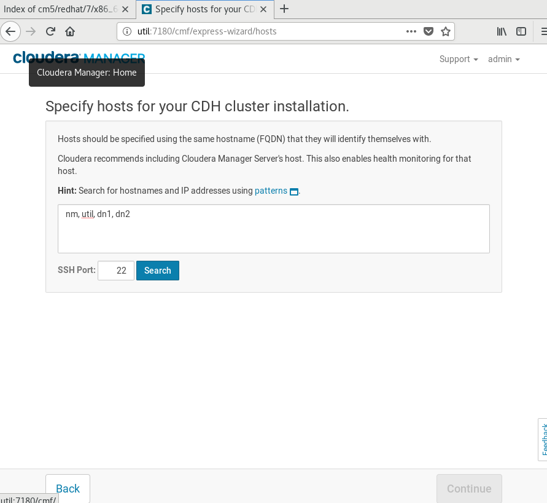
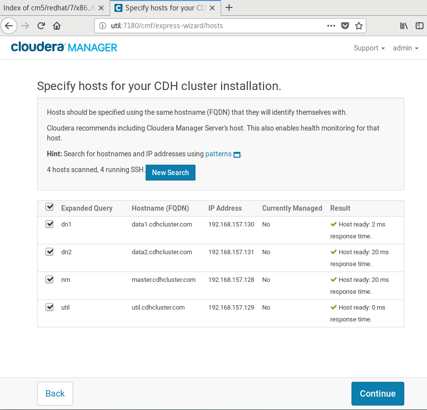
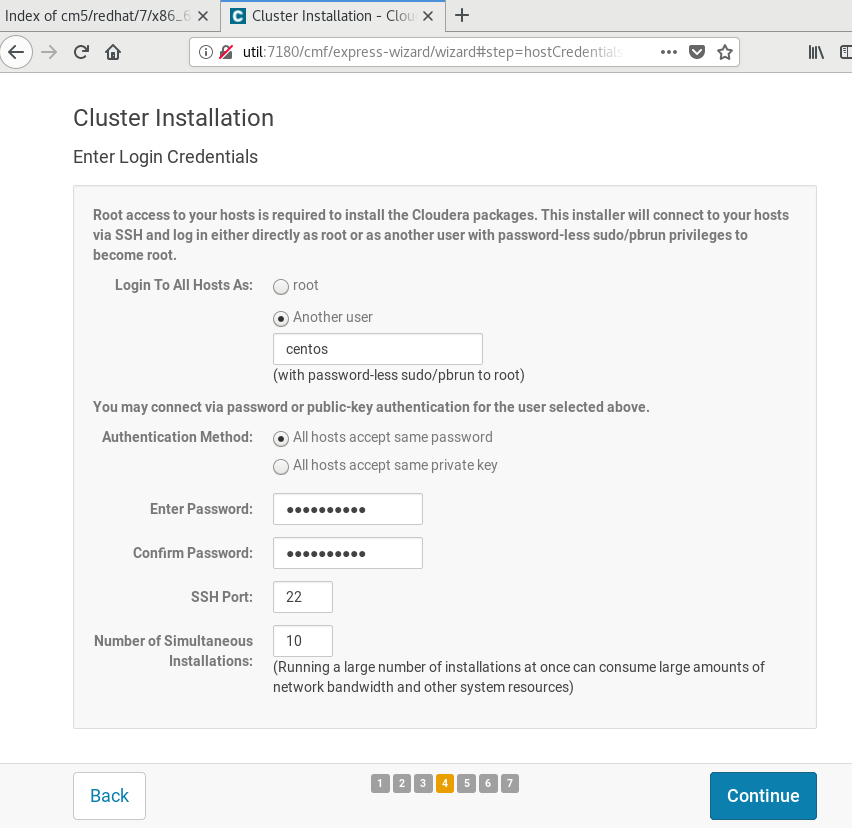
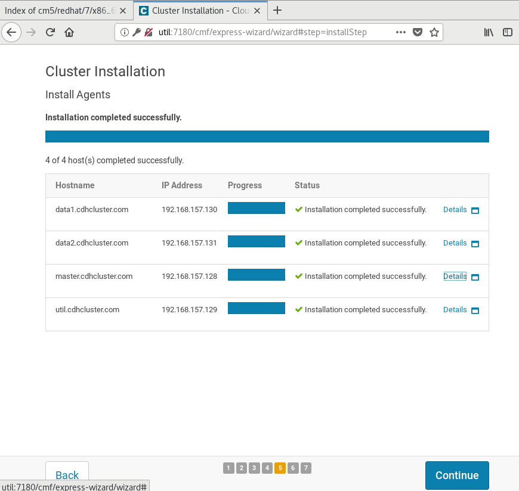
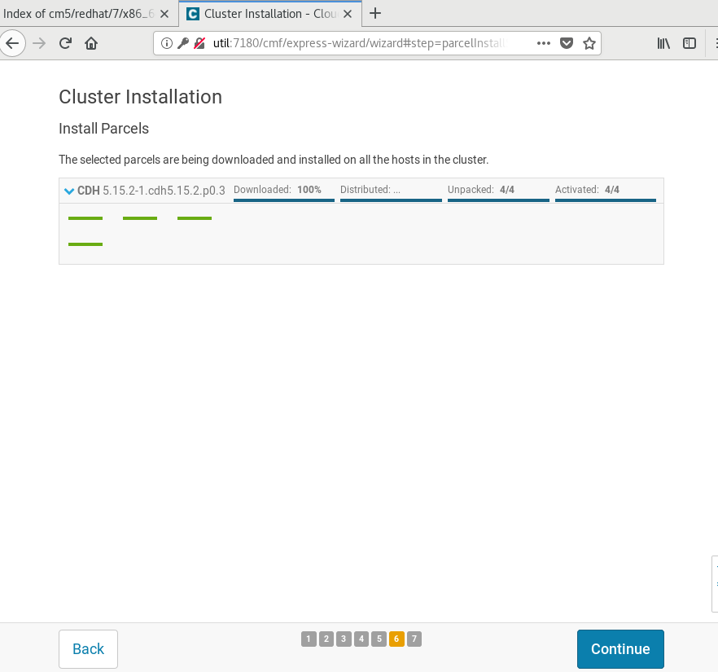
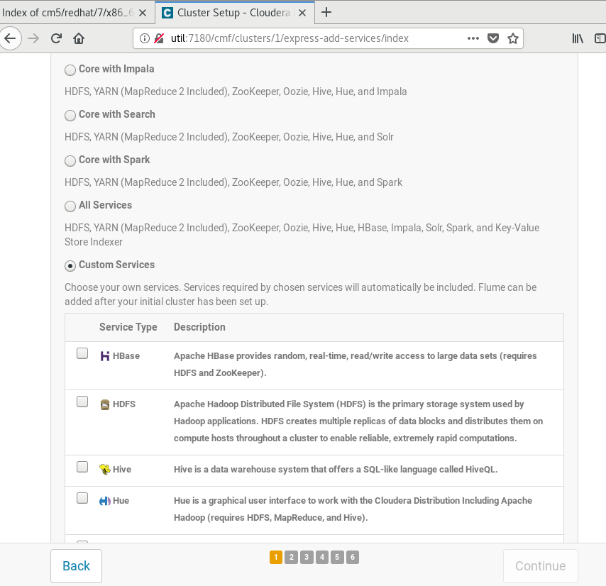
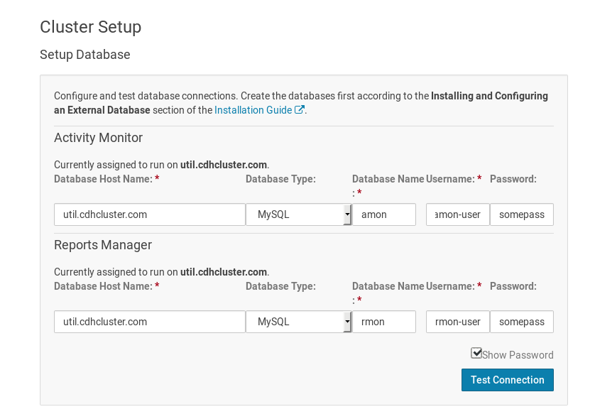
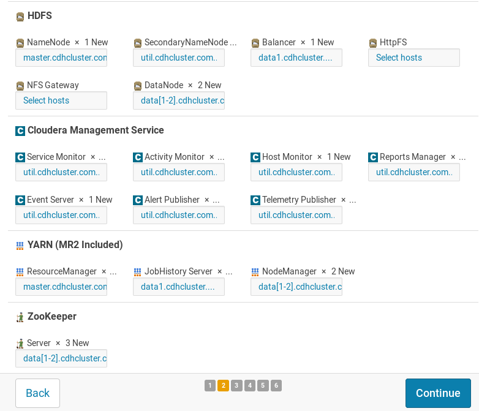
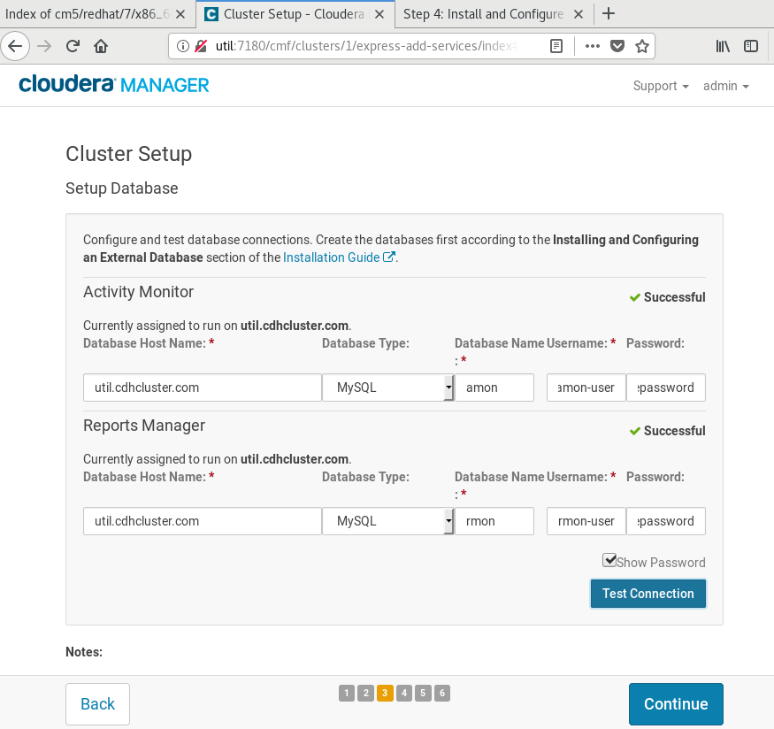

## PART 1 : 클러스터 구축 실습

* SSH KEY 생성 및 패스워드 없이 로그인
https://ourcstory.tistory.com/168
* cloudera 설치 방법 ( Linux, Cloudera Manager )
https://ourcstory.tistory.com/171
* AWS 환경에서 CLoudera Manager 설치하기
https://swalloow.github.io/cloudera-install
* Virtualbox CentOS 6.7 환경에서 CM 으로 Hadoop 설치
https://lsjsj92.tistory.com/432
* Cloudera 설치 - CM 설치 준비/환경설정
https://blog.naver.com/qkfl4/221435863884
* 참고 url 등
https://lsjsj92.tistory.com/432
https://github.com/insun13/bigdata/blob/master/test/Part1.md
http://blog.naver.com/PostView.nhn?blogId=qkfl4&logNo=221435864078
http://hwengineer.blogspot.com/2018/11/x86-hadoop-cluster-hdfs-ibm-power-linux.html
https://www.cloudera.com/documentation/enterprise/5-15-x/topics/install_software_cm_wizard.html
https://wooyoung85.tistory.com/47
https://semode.tistory.com/73
https://abc2080.tistory.com/entry/CentOS-Cloudera-Manager-%EC%84%A4%EC%B9%98
https://www.cloudera.com/documentation/enterprise/latest/topics/cluster_setup_wizard.html#setup_wizard_review_changes
https://github.com/biospin/BigBio/blob/master/part03/week01_160503/hadoop/cloudera_install.md
https://www.cloudera.com/documentation/enterprise/5-15-x/topics/cm_ig_host_allocations.html#host_role_assignments


### 실습 시작

* VMware workstation Download
* centOS Download
http://isoredirect.centos.org/centos/7/isos/x86_64/CentOS-7-x86_64-DVD-1810.iso
* centOS 설치
https://corock.tistory.com/315
* 참고 url
http://blog.naver.com/PostView.nhn?blogId=qmfoemty&logNo=221439879510&from=search&redirect=Log&widgetTypeCall=true&directAccess=false
https://youl.me/7
https://quio314.tistory.com/5
* Cloudera 설치 / 주의사항 나와있음
https://wooyoung85.tistory.com/47


### 시작 전 확인 사항
```
VMware workstation Player 14 버전에 CentOS 7 4대를 각각 설치
> 16GB 이상일 경우 4대 , 8GB일 경우 3대로 실습해보는 것이 좋을 듯
> 메모리상 문제로 서버가 약해서 설치도중 죽는 현상 발생
설치시, 메모리는 40G, RAM은 2G로 할당
이더넷 네트워크는 켜있는 상태로 설정
소프트웨어는 GEOME ? 로 설정해야 윈도우처럼 사용가능
```
### 각 노드에서 hostname 확인
```
[centos@localhost ~]$ hostname -I
192.168.157.129 192.168.122.1

[centos@localhost ~]$ hostname -I
192.168.157.128 192.168.122.1

[centos@localhost ~]$ hostname -I
192.168.157.130 192.168.122.1

[centos@localhost ~]$ hostname -I
192.168.157.131 192.168.122.1
```

### centos version 확인

```
[centos@localhost ~]$ grep . /etc/*release
/etc/centos-release:CentOS Linux release 7.6.1810 (Core)
/etc/os-release:NAME="CentOS Linux"
/etc/os-release:VERSION="7 (Core)"
/etc/os-release:ID="centos"
/etc/os-release:ID_LIKE="rhel fedora"
/etc/os-release:VERSION_ID="7"
/etc/os-release:PRETTY_NAME="CentOS Linux 7 (Core)"
/etc/os-release:ANSI_COLOR="0;31"
/etc/os-release:CPE_NAME="cpe:/o:centos:centos:7"
/etc/os-release:HOME_URL="https://www.centos.org/"
/etc/os-release:BUG_REPORT_URL="https://bugs.centos.org/"
/etc/os-release:CENTOS_MANTISBT_PROJECT="CentOS-7"
/etc/os-release:CENTOS_MANTISBT_PROJECT_VERSION="7"
/etc/os-release:REDHAT_SUPPORT_PRODUCT="centos"
/etc/os-release:REDHAT_SUPPORT_PRODUCT_VERSION="7"
/etc/redhat-release:CentOS Linux release 7.6.1810 (Core)
/etc/system-release:CentOS Linux release 7.6.1810 (Core)
```
### centos bit 확인
```
[centos@localhost ~]$ getconf LONG_BIT
64
```
### update yum
```
root 권한으로 설치

sudo yum update
sudo yum install -y wget

root 권한으로 변경
sudo - i
```

### host 파일 확인
```
[root@localhost /]# cat /etc/hosts
127.0.0.1   localhost localhost.localdomain localhost4 localhost4.localdomain4
::1         localhost localhost.localdomain localhost6 localhost6.localdomain6
```
### hostname 변경
```
[root@localhost /]# hostnamectl set-hostname nm
[root@localhost /]#
[root@localhost /]# hostname
nm
```

### host 파일에 추가
```
[root@localhost /]# vi /etc/hosts
[root@localhost /]# cat /etc/hosts
127.0.0.1   localhost localhost.localdomain localhost4 localhost4.localdomain4
::1         localhost localhost.localdomain localhost6 localhost6.localdomain6
192.168.157.129 nm
```
이때, 192.168.157.128 master.cdhcluster.com nm 이런식으로 먼저 변경해주는게 좋음
이번 실습 시는 이부분을 뒤늦게 함

### 방화벽 내리기
```
[root@localhost /]# systemctl stop firewalld
[root@localhost /]# systemctl disable firewalld
Removed symlink /etc/systemd/system/multi-user.target.wants/firewalld.service.
Removed symlink /etc/systemd/system/dbus-org.fedoraproject.FirewallD1.service.
```

### 비밀번호 변경
```
[root@localhost /]# sudo passwd centos
centos 사용자의 비밀 번호 변경 중
새  암호:
잘못된 암호: 암호는 사전 검사에 실패했습니다  - 사전에 있는 단어를 기반으로 합니다  
새  암호 재입력:
passwd: 모든 인증 토큰이 성공적으로 업데이트 되었습니다.
[root@localhost /]#
```

### SSH를 사용하여 EC2 인스턴스에 로그인할 때 키 페어 대신에 암호 로그인을 활성화
```
[root@localhost /]# sudo vi /etc/ssh/sshd_config
PasswordAuthentication yes 로 수정 : 패스워드 인증 허용
```

### 재시작 후 상태 확인
```
[root@localhost /]# sudo systemctl restart sshd.service
[root@localhost /]# sudo systemctl status sshd.service
● sshd.service - OpenSSH server daemon
   Loaded: loaded (/usr/lib/systemd/system/sshd.service; enabled; vendor preset: enabled)
   Active: active (running) since 토 2019-06-29 22:16:58 KST; 6s ago
     Docs: man:sshd(8)
           man:sshd_config(5)
 Main PID: 77469 (sshd)
    Tasks: 1
   CGroup: /system.slice/sshd.service
           └─77469 /usr/sbin/sshd -D
```

### host에 나머지 노드 주소 추가
```
[root@localhost /]# vi /etc/hosts
[root@localhost /]# cat /etc/hosts
127.0.0.1   localhost localhost.localdomain localhost4 localhost4.localdomain4
::1         localhost localhost.localdomain localhost6 localhost6.localdomain6
192.168.157.128 nm
192.168.157.129 util
192.168.157.130 dn1
192.168.157.131 dn2
```

### SSH KEY ? 서버 접속 시 비밀번호 대신 KEY를 제출 하는 방식
```
[root@localhost /]# cd ~/.ssh
[root@localhost .ssh]# ll
합계 4
-rw-r--r--. 1 root root 180  6월 29 22:28 known_hosts
[root@localhost .ssh]# cat known_hosts
nm,192.168.157.128 ecdsa-sha2-nistp256 AAAAE2VjZHNhLXNoYTItbmlzdHAyNTYAAAAIbmlzdHAyNTYAAABBBJq8udbtNUWlGLmZhz0MjTF5ilj3V4ik14U2ZdfIJjYDyT1DhYujGNIzvRsiOyFEeb7NqAWw8el+4sKGLxGPfgg=
```
### rsa 방식으로 키 생성

- 참고 : https://opentutorials.org/module/432/3742
```
[root@localhost .ssh]# ssh-keygen -t rsa
Generating public/private rsa key pair.
Enter file in which to save the key (/root/.ssh/id_rsa):   
Enter passphrase (empty for no passphrase):
Enter same passphrase again:
Your identification has been saved in /root/.ssh/id_rsa.
Your public key has been saved in /root/.ssh/id_rsa.pub.
The key fingerprint is:
SHA256:ekJ2cJOSJVyt6SUElqxha7f0Ch0IuJLdgqcfOXPW1bw root@nm
The key's randomart image is:
+---[RSA 2048]----+
| .   o++o.       |
|. . o.++...      |
| = + =+.+=       |
|= + * ++=.+      |
|.o + =o*So .     |
|. = +o+oo E      |
| . * .o..        |
|  .   .o         |
|                 |
+----[SHA256]-----+
```
비밀번호 없이 다른 노드에 로그인할 수 있도록 key 세팅


### KEY gen
```
[root@localhost .ssh]# ssh-copy-id -i ~/.ssh/id_rsa.pub nm
/bin/ssh-copy-id: INFO: Source of key(s) to be installed: "/root/.ssh/id_rsa.pub"
/bin/ssh-copy-id: INFO: attempting to log in with the new key(s), to filter out any that are already installed
/bin/ssh-copy-id: INFO: 1 key(s) remain to be installed -- if you are prompted now it is to install the new keys
root@nm's password:
Permission denied, please try again.
root@nm's password:

Number of key(s) added: 1

Now try logging into the machine, with:   "ssh 'nm'"
and check to make sure that only the key(s) you wanted were added.
```

### 다른 노드에 접속 가능한 것을 확인
```
[root@localhost .ssh]# ssh nm
Last failed login: Sun Jun 30 00:19:33 KST 2019 from nm on ssh:notty
There were 11 failed login attempts since the last successful login.

나머지 노드들에도 key를 세팅 해줘야함
그 전에, 다른 서버에 들어가서 hostname , /etc/hosts 변경 필요
```

### selinux
```
sudo vi /etc/sysconfig/selinux >> SELINUX=disabled
reboot
```

### 다른 노드에 복사 시도
```
[root@nm ~]# ssh-copy-id -i ~/.ssh/id_rsa.pub dn1
/bin/ssh-copy-id: INFO: Source of key(s) to be installed: "/root/.ssh/id_rsa.pub"
/bin/ssh-copy-id: INFO: attempting to log in with the new key(s), to filter out any that are already installed

/bin/ssh-copy-id: ERROR: ssh: connect to host dn1 port 22: No route to host
```

### 포트 관련 에러가 나서 포트 먼저 확인
```
[root@nm ~]# ss -tnlp |grep ssh
LISTEN     0      128          *:22                       *:*                   users:(("sshd",pid=6974,fd=3))
LISTEN     0      128         :::22                      :::*                   users:(("sshd",pid=6974,fd=4))

* 일단 ip로 치니까 됐는데 이게 맞는지는 모르겠음...

[root@nm ~]# ssh-copy-id -i ~/.ssh/id_rsa.pub 192.168.157.130
/bin/ssh-copy-id: INFO: Source of key(s) to be installed: "/root/.ssh/id_rsa.pub"
The authenticity of host '192.168.157.130 (192.168.157.130)' can't be established.
ECDSA key fingerprint is SHA256:gPHL0r5BdrArV+oH1COjOyWBgW0twr6RyZcguF/2EXE.
ECDSA key fingerprint is MD5:ea:a7:90:2c:b9:62:17:d4:cb:26:a0:7e:85:ef:b6:ba.
Are you sure you want to continue connecting (yes/no)? yes
/bin/ssh-copy-id: INFO: attempting to log in with the new key(s), to filter out any that are already installed
/bin/ssh-copy-id: INFO: 1 key(s) remain to be installed -- if you are prompted now it is to install the new keys
root@192.168.157.130's password:
Permission denied, please try again.
root@192.168.157.130's password:

Number of key(s) added: 1

Now try logging into the machine, with:   "ssh '192.168.157.130'"
and check to make sure that only the key(s) you wanted were added.

- 연결 됐음을 확인.
```

### 다른 노드에도 연결 된 것을 확인
```
[root@nm ~]# ssh dn1
The authenticity of host 'dn1 (192.168.157.130)' can't be established.
ECDSA key fingerprint is SHA256:gPHL0r5BdrArV+oH1COjOyWBgW0twr6RyZcguF/2EXE.
ECDSA key fingerprint is MD5:ea:a7:90:2c:b9:62:17:d4:cb:26:a0:7e:85:ef:b6:ba.
Are you sure you want to continue connecting (yes/no)? yes
Warning: Permanently added 'dn1' (ECDSA) to the list of known hosts.
Last failed login: Sun Jun 30 01:44:48 KST 2019 from nm on ssh:notty
There was 1 failed login attempt since the last successful login.
Last login: Sun Jun 30 00:37:29 2019
[root@dn1 ~]#

- 같은 방법으로 dn2도 key 추가
```

### 각 서버 hostname 변경
다음 실습 시, 이 작업부터 해줘야함
```
192.168.157.128 master.cdhcluster.com nm
192.168.157.129 util.cdhcluster.com util
192.168.157.130 data1.cdhcluster.com dn1
192.168.157.131 data2.cdhcluster.com dn2
```
## install CM

### config repositry CM

* util 서버에 cm 설치
* 참고 : https://www.cloudera.com/documentation/enterprise/5-15-x/topics/configure_cm_repo.html

```
[centos@util ~]$ sudo wget https://archive.cloudera.com/cm5/redhat/7/x86_64/cm/cloudera-manager.repo -P /etc/yum.repos.d/
--2019-06-30 12:45:17--  https://archive.cloudera.com/cm5/redhat/7/x86_64/cm/cloudera-manager.repo
Resolving archive.cloudera.com (archive.cloudera.com)... 151.101.72.167
Connecting to archive.cloudera.com (archive.cloudera.com)|151.101.72.167|:443... connected.
HTTP request sent, awaiting response... 200 OK
Length: 290 [binary/octet-stream]
Saving to: ‘/etc/yum.repos.d/cloudera-manager.repo’

100%[======================================>] 290         --.-K/s   in 0s      

2019-06-30 12:45:17 (13.2 MB/s) - ‘/etc/yum.repos.d/cloudera-manager.repo’ saved [290/290]
```

### baseurl 수정
```
[centos@util ~]$ sudo vi /etc/yum.repos.d/cloudera-manager.repo
baseurl=https://archive.cloudera.com/cm5/redhat/6/x86_64/cm/5.15.2/
```

### rpm 에 key 추가
```
[centos@util ~]$ sudo rpm --import \
> https://archive.cloudera.com/cm5/redhat/7/x86_64/cm/RPM-GPG-KEY-cloudera
```

### util 에 jdk, maria db 등을 설치

* repository 먼저 확인
* yum 설정은 yum.conf 에서 하고있으며, yum.repos.d 에 있는 파일에 지정된 서버주소로부터 패키지들을 설치하고 관리할 수 있음
```
[centos@util ~]$ grep -i exclude /etc/yum.conf /etc/yum.repos.d/*
[centos@util ~]$ yum repolist all

```
### 설치 가능한 list 확인
```
[centos@util ~]$ yum list oracle*
Loaded plugins: fastestmirror, langpacks
Loading mirror speeds from cached hostfile
 * base: mirror.kakao.com
 * extras: mirror.kakao.com
 * updates: mirror.kakao.com
Available Packages
oracle-j2sdk1.7.x86_64             1.7.0+update67-1             cloudera-manager
```

### jdk 설치
```
[centos@util ~]$ sudo yum install oracle-j2sdk1.7
```

### java version 확인
```
[centos@util ~]$ java -version
openjdk version "1.8.0_181"
OpenJDK Runtime Environment (build 1.8.0_181-b13)
OpenJDK 64-Bit Server VM (build 25.181-b13, mixed mode)

```
### Cloudera server install
```
- 자꾸 5.16 버전을 가져오려고 해서 원인 찾는 중
- yum list로 보니까 5.16 버전이 깔림
- 7버전으로 바꿔봤는데도 5.16 버전이 깔리고있음
baseurl=https://archive.cloudera.com/cm5/redhat/7/x86_64/cm/5.15.2/

- list 확인하면 이렇게 뜸
[centos@util ~]$ yum list cloudera*
Loaded plugins: fastestmirror, langpacks
Loading mirror speeds from cached hostfile
 * base: mirror.kakao.com
 * extras: mirror.kakao.com
 * updates: mirror.kakao.com
Available Packages
cloudera-manager-agent.x86_64                   5.16.2-1.cm5162.p0.7.el7             cloudera-manager
cloudera-manager-daemons.x86_64                 5.16.2-1.cm5162.p0.7.el7             cloudera-manager
cloudera-manager-server.x86_64                  5.16.2-1.cm5162.p0.7.el7             cloudera-manager
cloudera-manager-server-db-2.x86_64             5.16.2-1.cm5162.p0.7.el7             cloudera-manager

- downgrade를 위해서 clean

[centos@util ~]$ sudo yum clean all
[centos@util ~]$ sudo yum repolist

- cloudera version 재확인
[centos@util ~]$ yum list cloudera*
Loaded plugins: fastestmirror, langpacks
Loading mirror speeds from cached hostfile
 * base: mirror.kakao.com
 * extras: mirror.kakao.com
 * updates: mirror.kakao.com
cloudera-manager                                                                                 7/7
Available Packages
cloudera-manager-agent.x86_64                   5.15.2-1.cm5152.p0.2.el7             cloudera-manager
cloudera-manager-daemons.x86_64                 5.15.2-1.cm5152.p0.2.el7             cloudera-manager
cloudera-manager-server.x86_64                  5.15.2-1.cm5152.p0.2.el7             cloudera-manager
cloudera-manager-server-db-2.x86_64             5.15.2-1.cm5152.p0.2.el7             cloudera-manager
```
### error 확인 후 cloudera install
```
[centos@util ~]$ sudo yum install cloudera-manager-daemons cloudera-manager-server

```

### util 에 maria db 설치
```
[centos@util ~]$ sudo yum install -y mariadb-server
```

### mariadb 내렸다가 재시작
```
[centos@util ~]$ sudo systemctl enable mariadb
Created symlink from /etc/systemd/system/multi-user.target.wants/mariadb.service to /usr/lib/systemd/system/mariadb.service.
[centos@util ~]$ sudo systemctl start mariadb
```

### mariadb 권한 설정
* 설정사항은 재확인 필요
```
- 참고 url : https://www.cloudera.com/documentation/enterprise/5-15-x/topics/cm_ig_installing_configuring_dbs.html
[centos@util ~]$ sudo /usr/bin/mysql_secure_installation

NOTE: RUNNING ALL PARTS OF THIS SCRIPT IS RECOMMENDED FOR ALL MariaDB
      SERVERS IN PRODUCTION USE!  PLEASE READ EACH STEP CAREFULLY!

In order to log into MariaDB to secure it, we'll need the current
password for the root user.  If you've just installed MariaDB, and
you haven't set the root password yet, the password will be blank,
so you should just press enter here.

Enter current password for root (enter for none):
OK, successfully used password, moving on...

Setting the root password ensures that nobody can log into the MariaDB
root user without the proper authorisation.

You already have a root password set, so you can safely answer 'n'.

* password 설정

Change the root password? [Y/n] Y
New password:
Re-enter new password:
Password updated successfully!
Reloading privilege tables..
 ... Success!


By default, a MariaDB installation has an anonymous user, allowing anyone
to log into MariaDB without having to have a user account created for
them.  This is intended only for testing, and to make the installation
go a bit smoother.  You should remove them before moving into a
production environment.

Remove anonymous users? [Y/n] n
 ... skipping.

Normally, root should only be allowed to connect from 'localhost'.  This
ensures that someone cannot guess at the root password from the network.

* 원격접속여부
Disallow root login remotely? [Y/n] Y  >> N 했어야하는거같음...
 ... Success!

By default, MariaDB comes with a database named 'test' that anyone can
access.  This is also intended only for testing, and should be removed
before moving into a production environment.

* test db삭제여부
Remove test database and access to it? [Y/n] n
 ... skipping.

Reloading the privilege tables will ensure that all changes made so far
will take effect immediately.

* 지금까지설정한 권한정보 적용여부
Reload privilege tables now? [Y/n] Y
 ... Success!

Cleaning up...

All done!  If you've completed all of the above steps, your MariaDB
installation should now be secure.

Thanks for using MariaDB!
```

### 모든 노드에 mysql-JDBC Connector install
```
[centos@util ~]$ sudo wget https://dev.mysql.com/get/Downloads/Connector-J/mysql-connector-java-5.1.47.tar.gz
[centos@util ~]$ tar zxvf mysql-connector-java-5.1.47.tar.gz
[centos@util ~]$ sudo mkdir -p /usr/share/java/
[centos@util ~]$ cd mysql-connector-java-5.1.47
[centos@util mysql-connector-java-5.1.47]$ sudo cp mysql-connector-java-5.1.47-bin.jar /usr/share/java/mysql-connector-java.jar
[centos@util mysql-connector-java-5.1.47]$ cd /usr/share/java/
[centos@util java]$ sudo yum install mysql-connector-java
```

### mysql version 확인 / login
```
[centos@util java]$ mysql --version
mysql  Ver 15.1 Distrib 5.5.60-MariaDB, for Linux (x86_64) using readline 5.1
[centos@util java]$ mysql -u root -p
Enter password:
Welcome to the MariaDB monitor.  Commands end with ; or \g.
Your MariaDB connection id is 19
Server version: 5.5.60-MariaDB MariaDB Server

Copyright (c) 2000, 2018, Oracle, MariaDB Corporation Ab and others.

Type 'help;' or '\h' for help. Type '\c' to clear the current input statement.

MariaDB [(none)]>
```

### database 확인
```
MariaDB [(none)]> show databases;
+--------------------+
| Database           |
+--------------------+
| information_schema |
| mysql              |
| performance_schema |
| test               |
+--------------------+
4 rows in set (0.00 sec)
```

### db, user 생성
```
MariaDB [(none)]> CREATE DATABASE scm DEFAULT CHARACTER SET utf8 DEFAULT COLLATE utf8_general_ci;
Query OK, 1 row affected (0.02 sec)

MariaDB [(none)]> GRANT ALL ON scm.* TO 'scm-user'@'%' IDENTIFIED BY 'somepassword';
Query OK, 0 rows affected (0.01 sec)

MariaDB [(none)]>
MariaDB [(none)]> CREATE DATABASE amon DEFAULT CHARACTER SET utf8 DEFAULT COLLATE utf8_general_ci;
Query OK, 1 row affected (0.00 sec)

MariaDB [(none)]> GRANT ALL ON amon.* TO 'amon-user'@'%' IDENTIFIED BY 'somepassword';
Query OK, 0 rows affected (0.00 sec)

MariaDB [(none)]>
MariaDB [(none)]> CREATE DATABASE rmon DEFAULT CHARACTER SET utf8 DEFAULT COLLATE utf8_general_ci;
Query OK, 1 row affected (0.00 sec)

MariaDB [(none)]> GRANT ALL ON rmon.* TO 'rmon-user'@'%' IDENTIFIED BY 'somepassword';
Query OK, 0 rows affected (0.00 sec)

MariaDB [(none)]>
MariaDB [(none)]> CREATE DATABASE hue DEFAULT CHARACTER SET utf8 DEFAULT COLLATE utf8_general_ci;
Query OK, 1 row affected (0.00 sec)

MariaDB [(none)]> GRANT ALL ON hue.* TO 'hue-user'@'%' IDENTIFIED BY 'somepassword';
Query OK, 0 rows affected (0.00 sec)

MariaDB [(none)]>
MariaDB [(none)]> CREATE DATABASE metastore DEFAULT CHARACTER SET utf8 DEFAULT COLLATE utf8_general_ci;
Query OK, 1 row affected (0.00 sec)

MariaDB [(none)]> GRANT ALL ON metastore.* TO 'metastore-user'@'%' IDENTIFIED BY 'somepassword';
Query OK, 0 rows affected (0.00 sec)

MariaDB [(none)]>
MariaDB [(none)]> CREATE DATABASE sentry DEFAULT CHARACTER SET utf8 DEFAULT COLLATE utf8_general_ci;
Query OK, 1 row affected (0.00 sec)

MariaDB [(none)]> GRANT ALL ON sentry.* TO 'sentry-user'@'%' IDENTIFIED BY 'somepassword';
Query OK, 0 rows affected (0.00 sec)

MariaDB [(none)]>
MariaDB [(none)]> CREATE DATABASE oozie DEFAULT CHARACTER SET utf8 DEFAULT COLLATE utf8_general_ci;
Query OK, 1 row affected (0.00 sec)

MariaDB [(none)]> GRANT ALL ON oozie.* TO 'oozie-user'@'%' IDENTIFIED BY 'somepassword';
Query OK, 0 rows affected (0.00 sec)

MariaDB [(none)]>
MariaDB [(none)]> FLUSH PRIVILEGES;
Query OK, 0 rows affected (0.01 sec)
```
### db 생성 확인
```
MariaDB [(none)]> show databases;
+--------------------+
| Database           |
+--------------------+
| information_schema |
| amon               |
| hue                |
| metastore          |
| mysql              |
| oozie              |
| performance_schema |
| rmon               |
| scm                |
| sentry             |
| test               |
+--------------------+
11 rows in set (0.00 sec)
```

### 설정오류 시 참고
```
# yum remove -y mariadb101u-libs.x86_64
# yum remove -y mariadb101u-common.x86_64
# yum remove -y mariadb101u-config.x86_64
# rm -rf /var/log/mysql
# rm -rf /var/lib/mysql
# rm -rf /etc/mysql
```

### setup CM DB
```
[centos@util /]$ sudo /usr/share/cmf/schema/scm_prepare_database.sh mysql scm scm-user somepassword

java.sql.SQLException: Access denied for user 'scm-user'@'localhost' (using password: YES)
이런 에러가 남

- 에러나서 현재 상태 확인
[centos@util /]$ systemctl status cloudera-scm-server
- 다시 mysql 들어가보니 생성한 db,user들이 삭제되어있었음 > 아니었음. root 계정으로 안들어가서 그럼
```
### user,pw,host확인
```
MariaDB [(none)]> select user, password, host from mysql.user;
+----------------+-------------------------------------------+---------------------+
| user           | password                                  | host                |
+----------------+-------------------------------------------+---------------------+
| root           | *81F5E21E35407D884A6CD4A731AEBFB6AF209E1B | localhost           |
| root           | *81F5E21E35407D884A6CD4A731AEBFB6AF209E1B | 127.0.0.1           |
| root           | *81F5E21E35407D884A6CD4A731AEBFB6AF209E1B | ::1                 |
|                |                                           | localhost           |
|                |                                           | util.cdhcluster.com |
| scm-user       | *DAABDB4081CCE333168409A6DB119E18D8EAA073 | %                   |
| amon-user      | *DAABDB4081CCE333168409A6DB119E18D8EAA073 | %                   |
| rmon-user      | *DAABDB4081CCE333168409A6DB119E18D8EAA073 | %                   |
| hue-user       | *DAABDB4081CCE333168409A6DB119E18D8EAA073 | %                   |
| metastore-user | *DAABDB4081CCE333168409A6DB119E18D8EAA073 | %                   |
| sentry-user    | *DAABDB4081CCE333168409A6DB119E18D8EAA073 | %                   |
| oozie-user     | *DAABDB4081CCE333168409A6DB119E18D8EAA073 | %                   |
+----------------+-------------------------------------------+---------------------+
```

### 내렸다 올리고 재 접속
```
[root@util ~]# service mysqld stop
Redirecting to /bin/systemctl stop mysqld.service
Failed to stop mysqld.service: Unit mysqld.service not loaded.
[root@util ~]# service mysqld start
Redirecting to /bin/systemctl start mysqld.service
Failed to start mysqld.service: Unit not found.
[root@util ~]# mysql -u root -p
이때, 비번은 somepassword로 변경되어있음
```

### 문제 해결
```
-- java.sql.SQLException: Access denied for user 'scm-user'@'localhost' (using password: YES) 에러를 해결하기 위해 다시 mysql접속 후 localhost 추가
GRANT ALL ON scm.* TO 'scm-user'@'localhost' IDENTIFIED BY 'somepassword';
FLUSH PRIVILEGES;
```

### setup CM DB
```
[root@util cloudera-scm-server]# sudo /usr/share/cmf/schema/scm_prepare_database.sh mysql scm scm-user somepassword
```

### server start, log로 서버 올라가는것 확인
```
[root@util cloudera-scm-server]# sudo systemctl start cloudera-scm-server
[root@util cloudera-scm-server]# tail -f /var/log/cloudera-scm-server/cloudera-scm-server.log
```
### CM 초기화면 Login
```
http://util:7180
admin / admin
- trial 선택
- 화면상에 Could not connect to host. 라고 보이는 경우 ssh server가 제대로 설치되었는지 재 확인
# sudo yum install openssh-server
# /sbin/service sshd status
# /sbin/service sshd start
# ssh localhost
```
* 서버 재시작 시
```
# service cloudera-scm-server restart
# service cloudera-scm-agent restart
# sudo systemctl start cloudera-scm-server
```
* node heartbeat 오류 시 참고
https://community.cloudera.com/t5/Cloudera-Manager-Installation/Getting-quot-heartbeat-quot-errors-when-trying-to-install/ta-p/36843

### 참고
```
이떄, vm은 다 띄워놔야 함
continue 하면서 jdk 설치 x, single user mode 선택 x
install은 id/pw로 할수도있고 key로 할수도 있음
* aws에서 linux를 깔면 centos or ec2-user 둘중 하나로 접근이 가능함
* 시험날은 key pair 가 주어질 예정 / 각각 접속하는 건 쉬운데, 옆으로 접속하는건 쉽지 않음. 조작이 필요함
* 그렇기 떄문에 key pair 사용시, 각각 서버에다가 pw를 넣어주는게 좋음. pw YES로 설정
* key user pw로 접속하는게 더 쉬울 것
```

* NAS 장치에 DataNode 데이터 디렉토리를 두지 마십시오. NAS의 크기를 재조정하면 복제본을 삭제할 수 있으므로 블록이 누락됨
* DB 연결시, 연결이 안될경우 mysql에서 hostname을 추가해야함
* 호스트가 꼬일 경우, install 시도 시 heartbeat error가 날 수 있음 (4번 그림)

1. 호스트 지정

2. 호스트 연결 확인

3. 로그인 인증 (centos로 접속 시 install 이 안되서 root로 접속함)

4. install 확인

5. install 완료

6. 사용자 지정 서비스 선택

7. cluster setup

8. 서비스 구성

8. db연결 완료


* 뒷부분은 캡처 못함. 일단 기본 클러스터/서비스(HDFS, YARN, ZOOKEEPER) 설치 완료
